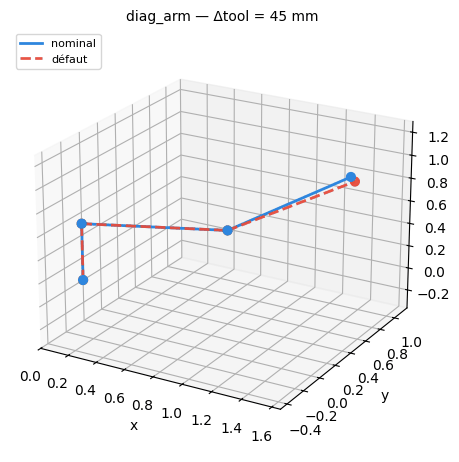
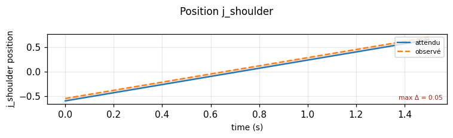
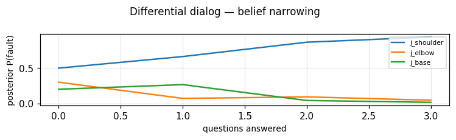

# Diagnostics, illustrated

A guided tour of the FieldPilot-MDG diagnostics loop — from a symptom in the
field to a French PDF report — on one worked scenario. Every figure here is
generated by [`generate_illustrations.py`](generate_illustrations.py) from the
same calls the runnable
[`examples/diagnostics_workflow.py`](../examples/diagnostics_workflow.py) makes,
so the pictures never drift from the code.

The loop:

> **symptom → localise → narrow by dialog → calibrate → recommend → record → report**

---

## The scenario

A 3-DOF arm (`base` yaw, `shoulder` & `elbow` pitch) is commanded to a pose, but
its tool is *measured* 45 mm away from where the model says it should be. The
real cause: the **shoulder joint is miscalibrated by 0.05 rad** — the model
doesn't know it yet.

Playing the commanded motion (solid) against the simulated faulted motion
(dashed) shows the tool drifting away as the shoulder extends — the divergence
is annotated in millimetres:



The same divergence, quantitatively — the **expected** shoulder-position trace
against the **observed** one, with the gap shaded (`render_trajectory_scope`):



These two visuals are exactly what the report shows the technician so the robot
in front of them can be compared to the model's prediction.

---

## Localise

`localize_joint_fault` ranks the joints by how well a single calibration offset
on each explains the measured deviation, via the geometric Jacobian:

| Joint | Estimated offset | Explains |
|---|---:|---:|
| **`j_shoulder`** | **+0.050 rad** | **98 %** |
| `j_elbow` | +0.050 rad | 33 % |
| `j_base` | −0.000 rad | 0 % |

The shoulder is the clear suspect, but the elbow isn't ruled out by geometry
alone — so we ask.

---

## Narrow by dialog

When candidates still compete, the differential engine asks the technician the
*most discriminating* question (highest information gain) and folds the answer
back in. A sample transcript (the bot speaks French to the tech):

| Step | Question (asked in French) | Answer | Leading | P |
|---|---|---|---|---:|
| 0 | _(prior from history)_ | — | `j_shoulder` | 0.66 |
| 1 | « Jeu au poignet/coude ? » | non | `j_shoulder` | 0.86 |
| 2 | _(resolved)_ | — | `j_shoulder` | **0.97** |

The posterior over candidates collapses onto the true fault as evidence arrives
— entropy drops from log₂(3) ≈ 1.58 bits toward zero:



Past cases prime this: `fault_priors` turns the case history into the step-0
prior, so a fleet that has seen this fault before starts closer to the answer.

---

## Calibrate

Once the joint is identified, `calibrate_joint_offsets` recovers the **exact**
offset from a handful of measured poses (Gauss-Newton over the Jacobian):

```text
calibrate -> offsets {'j_base': 0.0, 'j_shoulder': 0.05, 'j_elbow': -0.0}
position RMS 45.0 mm -> 0.00 mm
```

The corrected model now matches reality to sub-millimetre.

---

## Spare parts

The recommended fix (`recalibrate_encoder`, the best-proven solution for this
fault in the case history) carries its bill of materials into the report:

| Référence | Désignation | Qté |
|---|---|---:|
| ENC-1024 | Codeur incrémental 1024 ppr | 1 |
| CAL-KIT | Kit d'étalonnage articulaire | 1 |

---

## Field interactions

**Ask the tech for photos.** `photo_requests` returns the shots to collect,
tailored to the suspected joint (relayed to the technician in French):

- Vue d'ensemble du robot dans son environnement
- Gros plan sur la zone du problème signalé
- Gros plan sur l'articulation « j_shoulder » (moteur, réducteur, câblage)
- Plaque signalétique / étiquette du moteur de « j_shoulder »
- Photo illustrant le symptôme décrit lorsqu'il se produit
- Connecteurs et faisceau de câbles à proximité du défaut

**Assemble the report.** Once the diagnosis is **confirmed**,
`attach_simulation_illustrations` adds the 3D motion + oscilloscope figures above,
and `render_report_html` emits a self-contained French HTML document — diagnosis,
spare parts, the tech's photos beside the simulation's illustrations — ready for
Gotenberg to turn into the intervention PDF.

---

## From report to the Odoo intervention PDF

The library doesn't call Gotenberg or Odoo (the open core stays service-free) —
it builds the exact requests the SaaS/n8n side sends:

```python
from fieldpilot_urdf import gotenberg_request, intervention_attachment_vals, intervention_task_vals

req = gotenberg_request(html, filename="rapport_INT-2026-0042.pdf")  # HTML -> PDF via Gotenberg
pdf = requests.post(base + req.endpoint, **req.requests_kwargs()).content

att  = intervention_attachment_vals("INT-2026-0042", pdf, res_id=task_id)  # ir.attachment
task = intervention_task_vals(report, pdf_url=attachment_url)              # project.task fields
#  -> {'x_intervention_ref': 'INT-2026-0042', 'x_cause_probable': 'j_shoulder',
#      'x_rapport_pdf_url': '/web/content/…'}
```

The PDF lands on the `project.task` intervention with the diagnosed cause and the
report URL filled in.

---

## Back to the technician on Telegram

The loop closes in the tech's chat. `telegram_messages` builds the bot's replies
— the French summary, then each illustration (the 3D GIF as `sendAnimation`, the
scope PNG as `sendPhoto`), and the PDF as `sendDocument`:

```python
from fieldpilot_urdf import telegram_messages

for msg in telegram_messages(report, chat_id=tech_chat_id, pdf=pdf):
    requests.post(f"https://api.telegram.org/bot{TOKEN}/{msg.method}", **msg.requests_kwargs())
```

The tech receives, in French: *✅ Diagnostic confirmé — Défaut : j_shoulder —
Confiance : 97 % — Solution : recalibrate_encoder — Pièces : …*, followed by the
3D motion and the scope trace to compare against the robot in front of them.

---

## Spare parts to an Odoo SPA order

The fix's parts become an order in the SPA module — an Odoo `sale.order` linked
to the intervention. `spare_parts_order_vals` builds the create-values; a
`{reference: product_id}` map resolves known parts to catalogue products, and
`unresolved_part_refs` flags any that still need creating:

```python
from fieldpilot_urdf import spare_parts_order_vals, unresolved_part_refs

order = spare_parts_order_vals(report, partner_id=client_id, product_map={"ENC-1024": 1001})
#  -> {'partner_id': …, 'origin': 'INT-2026-0042',
#      'order_line': [(0, 0, {'product_id': 1001, 'product_uom_qty': 1, 'name': 'ENC-1024 — …'}), …]}
todo = unresolved_part_refs(report.spare_parts, {"ENC-1024": 1001})   # ['CAL-KIT']
```

---

## Case stats on the admin dashboard

Every resolved case feeds the fleet's statistics. `case_stats_summary` rolls the
case base into a KPI block the admin / MRR dashboard serves beside the revenue
numbers — totals, resolution rate, the faults that dominate, and the fixes that
work:

```python
from fieldpilot_urdf import case_stats_summary, load_cases

stats = case_stats_summary(load_cases())
stats.model_dump()
#  -> {'total_cases': 142, 'resolved_cases': 128, 'resolution_rate': 0.90,
#      'distinct_faults': 9,
#      'top_faults': [{'fault': 'j_shoulder', 'count': 41, 'share': 0.29}, …],
#      'top_solutions': [{'fault': 'j_shoulder', 'solution': 'recalibrate_encoder',
#                         'attempts': 38, 'successes': 36, 'success_rate': 0.95}, …]}
```

The same `fault_priors` that this history produces also primes the dialog at the
top of the loop — so the dashboard and the diagnosis share one growing memory.

A **weekly email digest** pushes the same KPIs to managers — `weekly_digest`
renders the summary into a French email (subject + HTML + text), with
week-over-week deltas when you pass last week's summary:

```python
from fieldpilot_urdf import weekly_digest

digest = weekly_digest(this_week, previous=last_week, period_label="semaine du 16/06/2026")
print(digest.subject)   # "Bilan diagnostic — semaine du 16/06/2026 : 5 intervention(s), 80 % résolues"
send_email(html=digest.html_body, text=digest.text_body)   # n8n / SMTP does the send
```

---

## Run it yourself

```bash
pip install "fieldpilot-urdf[viz]"
python examples/diagnostics_workflow.py      # the full loop, writes rapport.html
python docs/generate_illustrations.py        # regenerate the figures above
```
